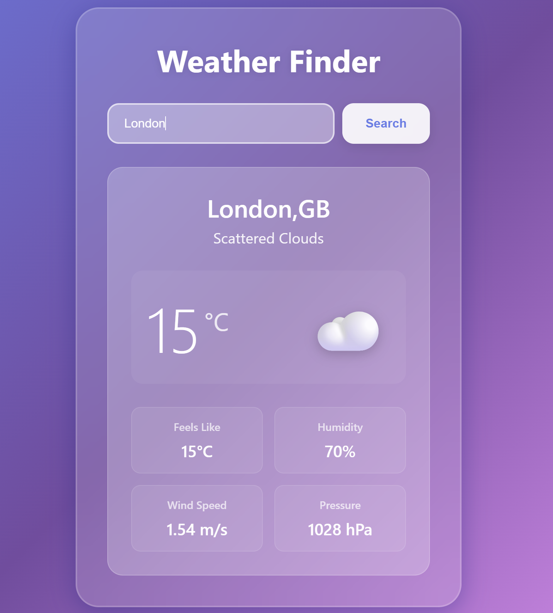

# Weather Finder

A weather app that taught me how React actually talks to the real world.

I built this on Day 22 of learning React - the day APIs finally made sense. Before this, all my data lived in useState. Now I know how to grab it from anywhere.

## [→ Try it](https://s-boldwin.github.io/react-weather-app/)

## 📸 Screenshot


---

## What it does

Type a city. Get the weather. That's it.

Temperature, humidity, wind speed, current conditions. Updates in real-time from OpenWeatherMap's API.

The design is glassmorphism - the frosted glass effect you see everywhere now. Picked it because I was tired of purple gradients.

---

## The learning curve

### What clicked

**useEffect finally made sense.**

Before this project, I read about useEffect but didn't *get it*. "Runs after render" - okay, but why do I care?

Then I tried fetching weather data on button click. Worked fine. But the code felt wrong. The fetch was in an event handler when it should've been... somewhere else?

That's when useEffect clicked. It's not about "after render" - it's about *where side effects belong*. API calls, localStorage, timers - they go in useEffect. Not in event handlers, not floating in the component, not in useState.
```javascript
useEffect(() => {
  // This is where you talk to the outside world
  fetchWeather();
}, [city]);
```

The dependency array `[city]` means "run this when city changes." That's the whole point - declarative side effects.

### The bug that taught me dependencies

First version had no dependency array:
```javascript
useEffect(() => {
  fetchWeather();
}); // No array = infinite loop
```

Burned through my API rate limit in 30 seconds. Every render triggered a fetch. Every fetch updated state. Every state update triggered a render.

Added `[]` and it ran once on mount. Added `[city]` and it ran when city changed. That's when I understood the dependency array isn't optional syntax - it's the whole control mechanism.

### The three states pattern

Every API call has three states:
```javascript
{loading && <Spinner />}
{error && <ErrorMessage />}
{weather && <WeatherData />}
```

Learned this the hard way. First version just showed data or nothing. User types wrong city name? Blank screen. Network fails? Blank screen. Still loading? Blank screen.

Three states give the user feedback at every step. This pattern shows up everywhere now - I see it in every app I use.

---

## What I actually learned

**Technical stuff:**
- useEffect with async/await
- API integration in React
- Loading and error states
- Conditional rendering based on data state
- Environment variables (API key safety)

**The real stuff:**
- How to read API documentation
- Why UX matters (loading states prevent "did it break?" moments)
- When to use useEffect vs event handlers
- How to debug infinite loops (check dependencies!)
- That 90% of React apps are just "fetch data, show data"

---

## The code

**Basic structure:**
```javascript
const [weather, setWeather] = useState(null);
const [loading, setLoading] = useState(false);
const [error, setError] = useState(null);

const fetchWeather = async () => {
  setLoading(true);
  setError(null);
  
  try {
    const response = await fetch(API_URL);
    const data = await response.json();
    setWeather(data);
  } catch (err) {
    setError(err.message);
  } finally {
    setLoading(false);
  }
};
```

Pattern I'll use in every future API call: set loading, try fetch, catch errors, finally reset loading.

---

## Running it yourself
```bash
git clone https://github.com/S-Boldwin/react-weather-app.git
cd react-weather-app
npm install
```

Get a free API key from [OpenWeatherMap](https://openweathermap.org/api) (takes 2 minutes).

Add it to the code:
```javascript
const API_KEY = "your_key_here";
```
```bash
npm start
```

Opens at `localhost:3000`.

---

## Tech used

- React 18 (useState, useEffect)
- OpenWeatherMap API
- Glassmorphism CSS
- No libraries (just React + fetch)

Built in 2 days. Debugged for 3 hours (mostly infinite loops and async issues). Deployed in 10 minutes.

---

Built by [Swithin Boldwin](https://github.com/S-Boldwin) · Learning full-stack development · March 2026

**If you're learning React and this helped you understand useEffect, star it.**
